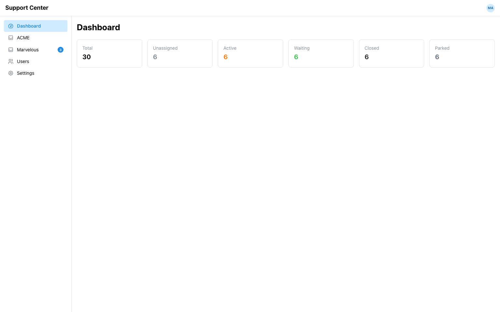
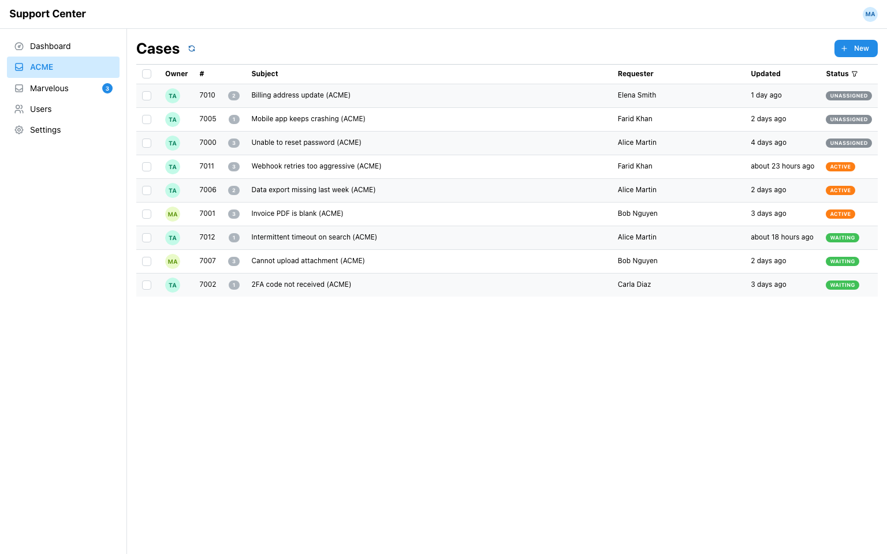
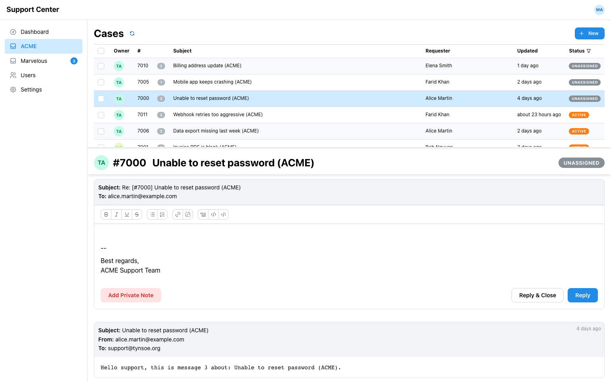
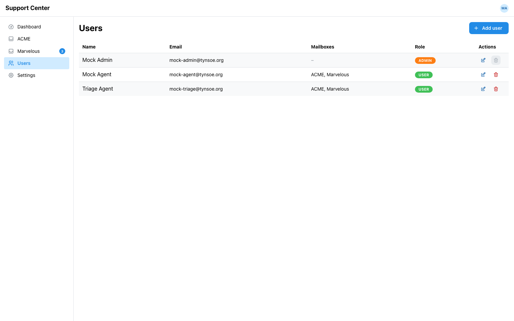
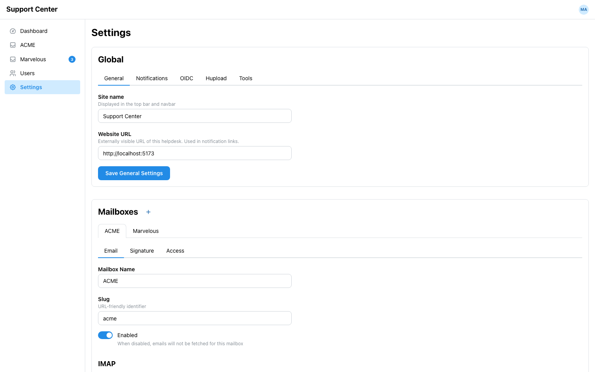

# Helpdesk

Helpdesk is an email-first customer support platform.

It turns incoming emails into organized support cases, gives your team a shared workspace to collaborate, and helps you respond faster with a clean web interface.

## What Helpdesk Is

Helpdesk is designed for teams that already receive support requests by email and want better visibility, ownership, and response workflows without forcing customers to use a portal.

With Helpdesk, you can:

- Connect one or more support inboxes
- Automatically convert emails into cases
- Assign, prioritize, and track work across agents
- Manage users, mailboxes, and global settings from an admin console

## Core Features

- Email to case pipeline:
	IMAP polling imports messages and creates or updates cases using thread-aware matching.
- Shared case inbox:
	Teams can view, filter, and triage all incoming requests from a unified list.
- Case conversation timeline:
	Full message history is available per case, including internal/private notes.
- Multi-mailbox support:
	Run multiple support brands or teams (for example ACME and Marvelous) in one instance.
- Role-based access:
	Admin and agent roles with mailbox-level access control.
- Admin workspace:
	Manage users, mailbox settings, authentication options, and integrations.
- OIDC integration:
    Use corporate authentication to log into helpdesk
- Pushover support:
    Pushover notifications can be configured per user
- Hupload integration:
    [Hupload](https://github.com/ybizeul/hupload) can be integrated to generate new customer shares and display uploaded files

## Screenshots

### Dashboard

### ACME Case List

### ACME Case Detail

### User Management

### Admin Settings

## Quick Start (Local)

### Prerequisites

- Go (recent version)
- Node.js + npm
- Docker
- mise: https://mise.jdx.dev

### Start Development Services

1. Start MongoDB:
	 mise mongo
2. Start backend API:
	 mise back
3. Start frontend dev server:
	 mise front

Or run backend + frontend together:

1. mise dev

By default:

- Frontend runs on http://localhost:5173
- Backend runs on http://localhost:8080

## Screenshot Refresh Workflow

To regenerate product screenshots with isolated demo data:

1. mise run update-screenshots

This workflow:

- Starts a dedicated MongoDB instance on a separate port
- Seeds demo data (including ACME and Marvelous mailboxes)
- Logs in as admin and captures dashboard, mailbox, user, and settings views

## Documentation

For technical details, see:

- docs/architecture.md
- docs/api.md
- docs/data-model.md

## License

MIT
